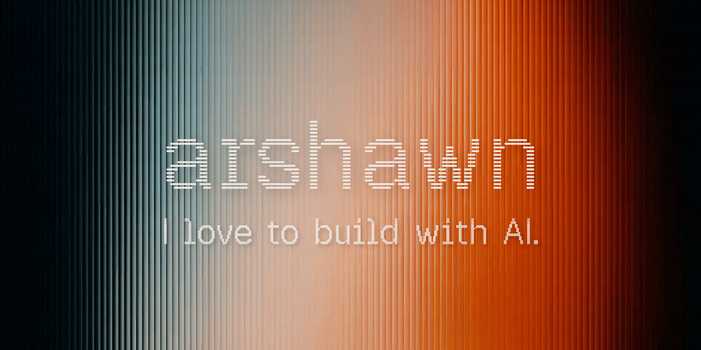

## Hi, I'm Arshawn

I build AI systems. Some to solve real problems, some just because they should exist.

Built my first business at 14. Everything since comes from the same place: obsession, AI tools, and a design philosophy I took from Apple. Design isn't decoration, it's function.

Incoming **Computer Engineering @ UC Santa Cruz** · open to internships & freelance

---

### Shipped

**[BidPilot](https://trybidpilot.com)** · pre-launch  
Pre-qualification SaaS for residential painting contractors. I co-founded a painting company, watched contractors waste thousands driving to estimates that didn't close, and started building the fix. Homeowners answer budget and scope questions before booking. Only serious leads reach the contractor. Currently validating with real contractors. Waitlist open at trybidpilot.com.

**[Cogni](https://github.com/arshawnarbabi/Cogni)** &nbsp;·&nbsp; [trycogni.vercel.app](https://trycogni.vercel.app)  
Self-hosted AI study system. Six agents handle everything from syllabus parsing to daily plan generation. FSRS spaced repetition at two levels, a Claude-powered tutor with RAG and persistent wiki memory, Google Calendar integration. Built because no study tool was actually intelligent.

**[LocalNotch](https://github.com/arshawnarbabi/LocalNotch)** &nbsp;·&nbsp; [localnotch.vercel.app](https://localnotch.vercel.app)  
On-device AI that lives in your MacBook's notch. Ollama-powered, so everything runs locally. Chat, vision, and web search with no cloud, no subscriptions, no data leaving your machine. Native Swift.

**[premium-website-templates](https://github.com/arshawnarbabi/premium-website-templates)** &nbsp;·&nbsp; v1.1  
Open-source design system templates that let AI tools build premium-grade websites from a single source of truth. Six files, ~4,000 lines of design research distilled into operational rules for web and mobile. Built it because AI defaults to generic SaaS output without a strong anchor — this is that anchor. MIT, free.

---

### How I Work

`AI Systems` &nbsp;`Multi-agent Pipelines` &nbsp;`Prompt Engineering` &nbsp;`UI/UX & Product Design` &nbsp;`Next.js` &nbsp;`Supabase` &nbsp;`Swift` &nbsp;`Rapid Prototyping`

---

### Currently

Running BidPilot outreach and getting contractors through the door.

---

📬 [arshawnaa@gmail.com](mailto:arshawnaa@gmail.com) &nbsp;·&nbsp; [LinkedIn](https://www.linkedin.com/in/arshawn-arbabi-73a40b19b/)
